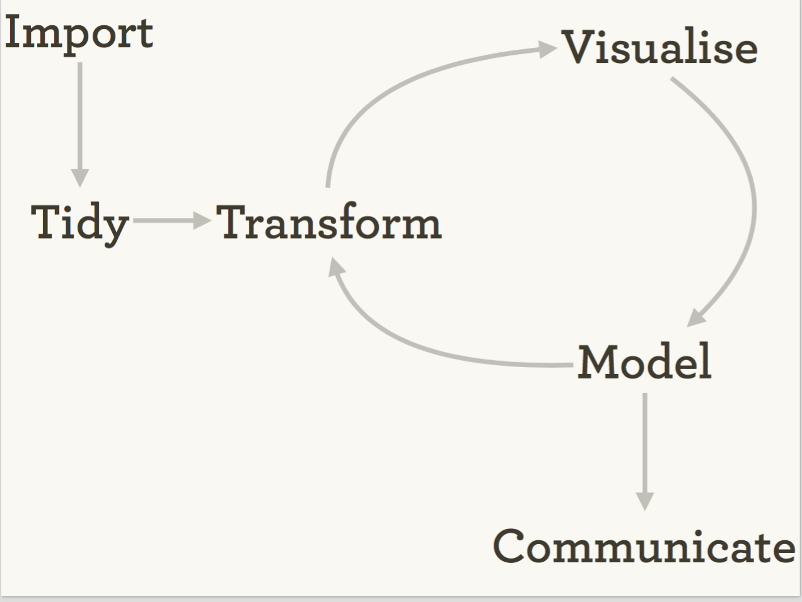
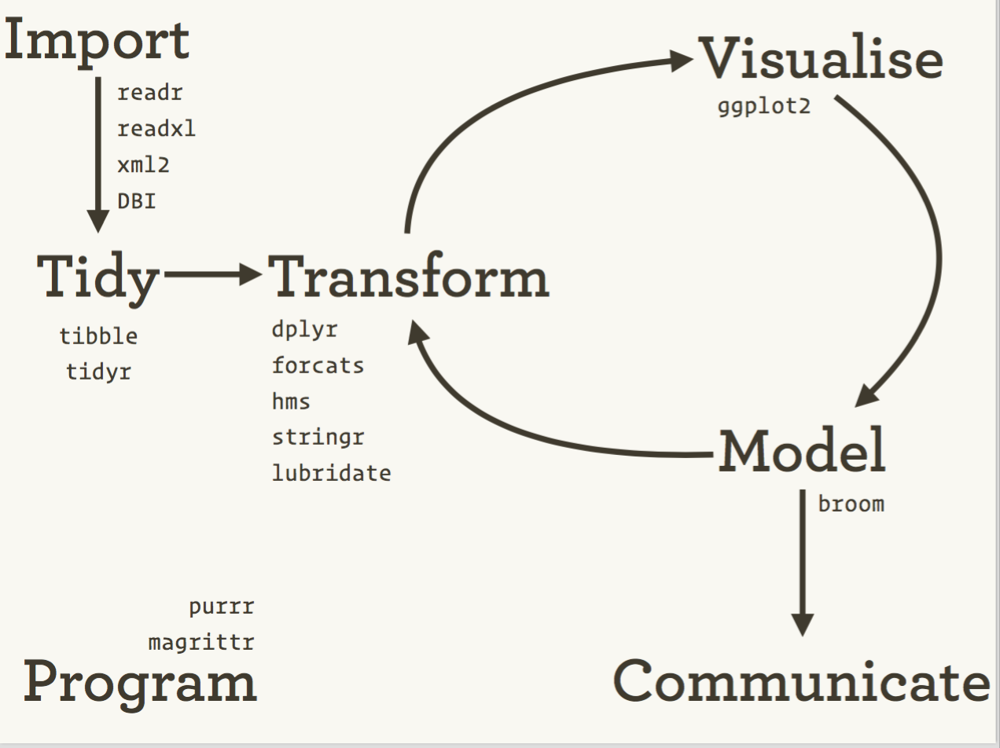

========================================================

## 程式知識

每次打開 `RStudio` 的範例檔，會看到`summary(cars)` 與 `plot(cars)` 的釋例，這些是什麼呢？

> 為了達成某種目的，學習電腦可以理解的語言，用該語言「說出」指令，希望電腦遵循，達到目的。所謂程式碼就是一連串的指令。食譜常常是個好的譬喻。


The Data Science Process
資料科學的食譜是什麼？


#### 簡化一點的圖解



## Data Science: R(Studio) way




## 我們要學習的，就是從「步驟」到「程式碼」。
- 所以你要了解 R 語言的「詞彙」和「語法」。


```r
# example
```


- 如果你「說錯話」了（很大的機率是你要負責），就要學著去**除錯**（debugging）。
    - 注意：說錯話還可分成「語法錯誤」還是「語意錯誤」。


## 學著從電腦的角度來思考
- 目前的電腦需要明確、循序漸進的指令。

舉例來說，妳如何判斷圖中誰最高？


那你覺得電腦如何判斷？

- 先從第一個人的身高開始。
- 假定他是「最高的人」。
- 將其他人的身高和目前「最高的人」做逐一的比較。
- 每次只要有人身高超越目前「最高的人」，他就取代變成目前「最高的人」。
- 比較完之後，就找出來了。


當然簡單的程式碼單純只處理一個事件。


```r
summary(cars)
```

```
##      speed           dist       
##  Min.   : 4.0   Min.   :  2.00  
##  1st Qu.:12.0   1st Qu.: 26.00  
##  Median :15.0   Median : 36.00  
##  Mean   :15.4   Mean   : 42.98  
##  3rd Qu.:19.0   3rd Qu.: 56.00  
##  Max.   :25.0   Max.   :120.00
```


不過，利用 $\matchcal{R}$ 內建的函式已經可以做很多事了。

```r
#data()
#head()
#tail()
#names()
#dim()
```


## 案例練習


```r
dogs <- read.table("../data/txt/dogs.txt",row.names = 1)
par(mfrow=c(1,2))
```
