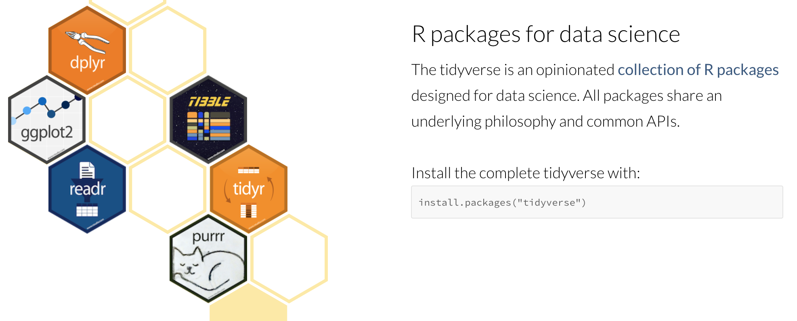

－－－－－යබයිබන－－－－－－


## 隨時意識到自己在哪裡？

找一本讀得下去的書配合學習，發問。（e.g., http://yijutseng.github.io/DataScienceRBook/）

> 複習 `Base R` [第一張重要小抄](http://github.com/rstudio/cheatsheets/raw/master/base-r.pdf) 

- 程式的結構
- 資料型態 Data type (string, number, date), 資料結構 Data structure (vector, matrix, data frame, list)
- Data frame 要特別花心思了解與熟悉。

> I/O


- RStudio 的懶人資料匯入法 (`Environment` - `Import Dataset`)
- 內建的 I/O 函數 `read.csv(),read.csv2(), read.table(),read.delim(), write.csv(), write.table().....`
- 利用 `readr` 套件 [第二張重要小抄](https://github.com/rstudio/cheatsheets/raw/master/data-import.pdf)


## 案例 A：玩不膩的鳶尾花

`iris` 各種檔案輸入練習。(G1 -> G2 -> ....-> G1)


## Data transformation/munging/wrangling (using `dplyr`)

- "載入資料之後，就進入資料整理（Data manipulation）或稱資料改寫（Data munging）、資料角力（Data wrangling）的部分。目的是為了方便探索、或者機器學習模型需求，必須將資料整理成合乎需求的格式。
- 到底什麼是 data manipulation?

> 進入資料探索分析 `Data Transformation` [第二張重要小抄](https://github.com/rstudio/cheatsheets/raw/master/data-transformation.pdf)


然後這張圖又出現了。


# Tidyverse： R 的簡約主義

 https://www.tidyverse.org/

- 站在神人的肩膀上做資料科學。
- 核心想法：
    - 資料的簡約要求 (tidy data)。http://r4ds.had.co.nz/tidy-data.html
    - 在某些場合使用管線概念寫程式 (pipeline)；
    - 資料清整的新文法 (dplyr)
    - 資料做圖的新文法 (ggplot2)


```{r foo1}
plot_important_things( 
  summarize(
    remove_dodgy_data(
      read_data("/some/path/some_file.data"))))
```


- Writing pipelines of function calls

`x %>% f` 等於 `f(x)`, `x %>% f %>% g %>% h` 等於 `h(g(f(x)))`

```{r foo2}
read_data("/some/path/some_file.data") %>% 
  remove_dodgy_data %>%
  summarize %>%
  plot_important_things
```


- `dplyr`


## 案例 B：玩不膩的鳶尾花之二

```{r}
library(tidyverse)
iris %>% summary()
iris %>% head(5)
```


```{r}
iris %>% 
  select(Species, Petal.Length) %>%
  qplot(Species, Petal.Length, geom = "boxplot", data = .)

```


## 案例 C：

- 團體練習：把程式與想法丟在 https://paper.dropbox.com/doc/Case-Study-Collaborative-Way-64YWTbYXKEviSqG8yppsc

A data frame with 58788 rows and 24 variables:


  - title. Title of the movie.
  - year. Year of release.
  - budget. Total budget (if known) in US dollars
  - length. Length in minutes.
  - rating. Average IMDB user rating.
  - votes. Number of IMDB users who rated this movie.
  - r1-10. Multiplying by ten gives percentile (to nearest 10%) of users who rated this   movie a 1.
  - mpaa. MPAA rating.
  - action, animation, comedy, drama, documentary, romance, short. Binary variables representing if movie was classified as belonging to that genre.


```{r}
install.packages("ggplot2movies")
library(ggplot2movies)
#movies <- read_csv(url("https://raw.githubusercontent.com/hadley/ggplot2movies/master/data-raw/movies.csv"))
dim(movies)
head(movies)
```


