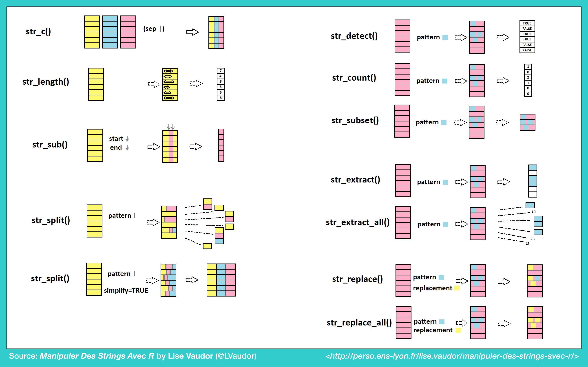

```{r}
needed <- c("jiebaR", "tidytext", "gutenbergr", "rvest", "wordcloud2")
install.packages(needed)
```

## Text as Data

- Text mining / Text analytics


## Pattern Matching using Regular Expressions (`regex` or `regexp`)


- Textual data is messy but meaningful. `regex` let us search for, clean, extract patterns from text to make it more meaningful.
- bit of language that can be used to describe a pattern within strings.


### Quick refresher: what is a string?
- A string is a sequence of characters that create a type of data.- Within R, strings belong to the class known as characters.
- Strings can consist of numbers, letters, spaces, and even some kinds of punctuation.
- `stringr`(part of `tidyverse`) a package in R that is designed to make working with strings easier by providing a consistent set of rules and conventions.
- We use the stringr package to manipulate strings within our dataset, often through the use of regular expressions. 



[又一張](https://www.rstudio.com/wp-content/uploads/2016/09/RegExCheatsheet.pdf)


### [Regular Expression in R](http://stat545.com/block022_regular-expression.html)


## EDA of Textual Data


### 中文處理的斷詞/分詞議題

- 字與詞 
- 為何需要斷詞
- 斷詞系統 

```{r}
library(tidyverse)
library(gutenbergr)
library(jiebaR)
library(jiebaRD)
library(wordcloud2)
```

- 使用「結巴」

```{r}
# 用 worker() 初始化斷詞引擎
seg <- worker()
seg
# 各種參數設定情參考  ?worker
```


- 斷詞簡單例子
```{r}
seg["台大最近的新聞怎麼這麼多"]
```

```{r}
seg["據台大語言所小編謝舒凱表示，宅宅也是非常用功 der"]
```


-設置停用詞表

```{r}
seg2 = worker(stop_word ="/Library/Frameworks/R.framework/Versions/3.2/Resources/library/jiebaRD/dict/stop_words.utf8")
seg2["據台大語言所小編謝舒凱表示，宅宅也是非常用功 der"]
```

- 詞類標記

```{r}
tagger <- worker("tag")
tagger["台大最近的新聞怎麼這麼多"]
```

[詞類訊息](http://www.hankcs.com/nlp/corpus/several-revenue-segmentation-system-used-set-of-source-tagging.html) 


- 讀檔斷詞

```{r}
outputfile <- seg["./你懂.txt"]
readLines(outputfile) # 改用 read_file? windows user 有編碼問題
```

- 合併分词结果 ??

```{r}
out2 <- sapply(outputfile, function(x){paste(x, collapse = " ")})
writeLines(out2, "./nidong.txt")
```


```{r}
library(rvest)
pttMOVIE <- "https://www.ptt.cc/bbs/movie/index.html"
pttContent <- read_html(pttMOVIE)
post_title <- pttContent %>% 
  html_nodes(".title") %>% 
  html_text()
post_title
```

```{r}
seg[post_title] ## 不分行輸出
```


```{r}
seg$bylines<-T
out3 <- seg[post_title] ## 分行輸出
```

```{r}
new_user_word(seg,'有抑無',"n")
```

- 最常出現的詞彙

```{r}
tem <- sort(table(unlist(seg[post_title])),decreasing = T)
#tem <- as.data.frame.table(tem)
```


- 文字雲 (`word cloud`) 用處不大，但是好玩。
    - `wordcloud2` provide traditional word cloud with HTML5.
    - 細節設定可以參考 [vignettes](https://cran.r-project.org/web/packages/wordcloud2/vignettes/wordcloud.html)
    - 還可以選自己的圖來當 mask ！


```{r}
library(wordcloud2)
## demoFreq is a data.frame including word and freq in each column.
wordcloud2(demoFreq, size = 1,shape = 'star')
#wordcloud2(demoFreq, size = 2, minRotation = -pi/6, maxRotation = -pi/6, rotateRatio = 1)
#wordcloud2(demoFreq, size = 2, minRotation = -pi/2, maxRotation = -pi/2)
wordcloud2(tem, size = 1,shape = 'star')
```


```{r}
letterCloud(demoFreq, word = "R", size = 2)
```

```{r}
## Sys.setlocale("LC_CTYPE","eng")
## Sys.setlocale("LC_ALL", "Chinese (Traditional)_Taiwan.950")
```


### 案例練習一：自己的文本
讀入「妳懂.txt」這篇文章，做出詞頻表和文字雲。


### 案例練習二：批踢踢的 NBA 版 
po 文的標題中，最常出現的前 10 個詞？所有的音譯人名 (`nrf`) ?


### 案例練習三：魯迅的吶喊

> https//www.gutenberg.org 是個開放的文本庫

```{r}
luxun <- gutenberg_download(27166)
str(luxun)
```

```{r}
luxun.seg <- seg[luxun$text]
```

- 建立詞頻表，更改變數名稱

```{r}
luxun_df <- unlist(luxun.seg)
luxun.freq <- freq(luxun_df)
colnames(luxun.freq) <- c("word", "freq")
```

```{r}
luxun.freq %>%
  arrange(desc(freq)) %>%
  head(20)
```

- 詞類標記

```{r}
pos.tagger <- worker("tag")
luxun.pos <- pos.tagger[luxun$text]

```


```{r}
fd <- data.frame(luxun.pos, names(luxun.pos))
colnames(fd) <- c("WORD", "POS")

```

```{r}
Word_POS_Freq <- fd %>%
  group_by(WORD, POS) %>%
  summarise(Frequency = n())
```

```{r}
Word_POS_Freq %>%
  arrange(desc(WORD))
```

- 取出所有標記為 `r` (代名詞) 的前 100 個詞。


協同解題平台：https://paper.dropbox.com/doc/Case-Study-Collaborative-Way-64YWTbYXKEviSqG8yppsc


---------
# 參考

- http://qinwenfeng.com/jiebaR/
- https://cran.r-project.org/web/packages/wordcloud2/vignettes/wordcloud.html
- http://tidytextmining.com/tidytext.html
- http://www.gastonsanchez.com/Handling_and_Processing_Strings_in_R.pdf


